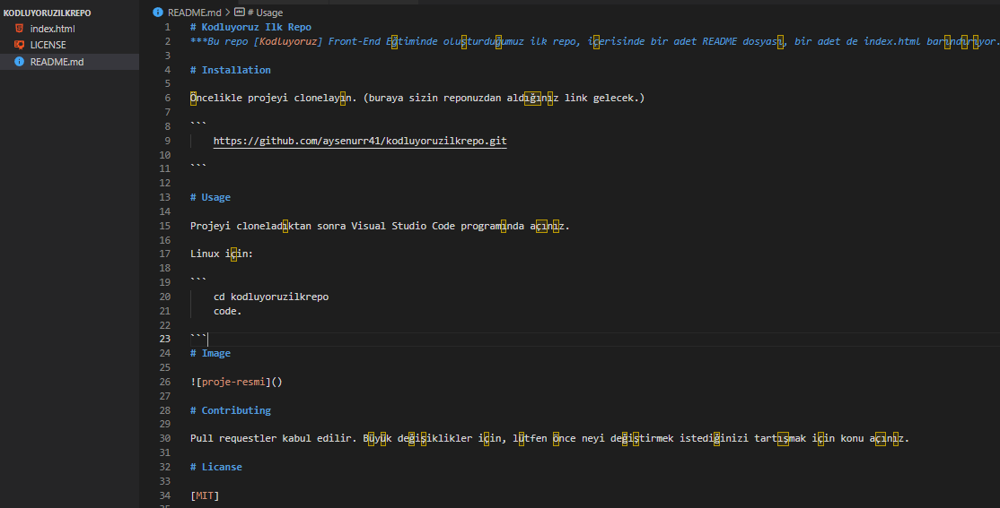

# Kodluyoruz Ilk Repo
***Bu repo [Kodluyoruz] Front-End Eğtiminde oluşturduğumuz ilk repo, içerisinde bir adet README dosyası, bir adet de index.html barındırıyor.***

# Installation

Öncelikle projeyi clonelayın. (buraya sizin reponuzdan aldığınız link gelecek.)

```
    https://github.com/aysenurr41/kodluyoruzilkrepo.git
	
```

# Usage

Projeyi cloneladıktan sonra Visual Studio Code programında açınız.

Linux için:

```
    cd kodluyoruzilkrepo
    code.
	
```
# Image



# Contributing

Pull requestler kabul edilir. Büyük değişiklikler için, lütfen önce neyi değiştirmek istediğinizi tartışmak için konu açınız.

# Licanse

[MIT]


